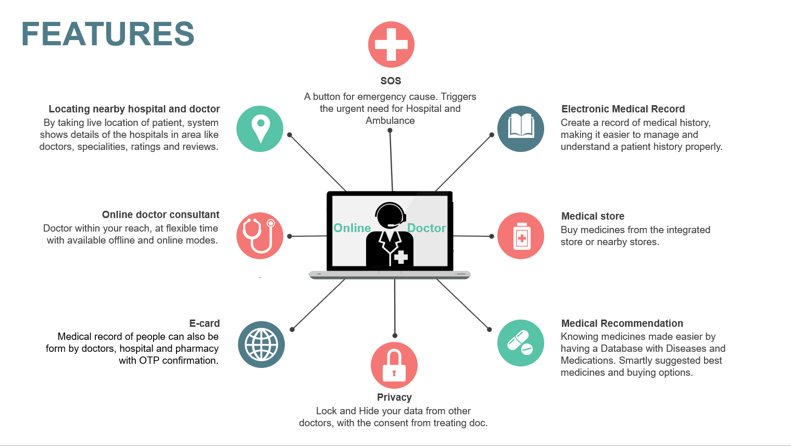

# Health-Website
Health Care, Medical Facilities, Consultation from doctors etc.
Domain: Health Care (Medical facilities, consultation from doctors etc.)
Think about all the struggles a normal person often faces in his daily 
life as the population in the world is increasing at such a high rate creating a growing demand
for diverse medical care which is cost effective and easily accessible.
We can control system using cloud computing which will have a purpose to help medical
and healthcare staff to easily access healthcare information from different sources
and centralize it in a common platform.

Patients, doctors, hospitals, pharmacy will be able to access prescribed medications,
reports while being cost effective and all this will be just be one touch away.

E-card can be issue for rural who are not comfortable with technology.

Patient have to give to OTP confirmation every time someone want to view data 
and it will be limited for a short period of time.

Main motive of our team is to deliver a complete centralized healthcare solution to the user
that enables the patients to get medical assistance at any time and anyplace. 

The application basically takes general health info about the user and about
their health record and maintains it.
 
It also have some game changing features like suggesting medicines that do not affect 
their current medication. 

Patient have an option to hide/unhide cured diseases from records and two way confirmation
for data security and privacy.

Every people have unique id which is linked to aadhar card which will help rural people to be 
a part of this system.

<html>
<head>
</head>
<body>
<h1>Features Diagram</h1>
 
</body>
